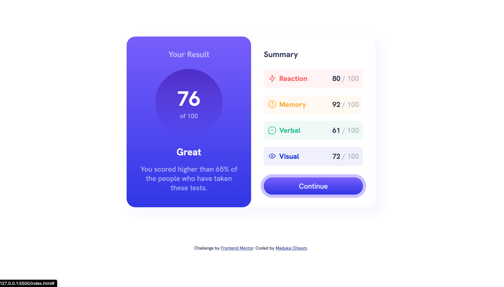
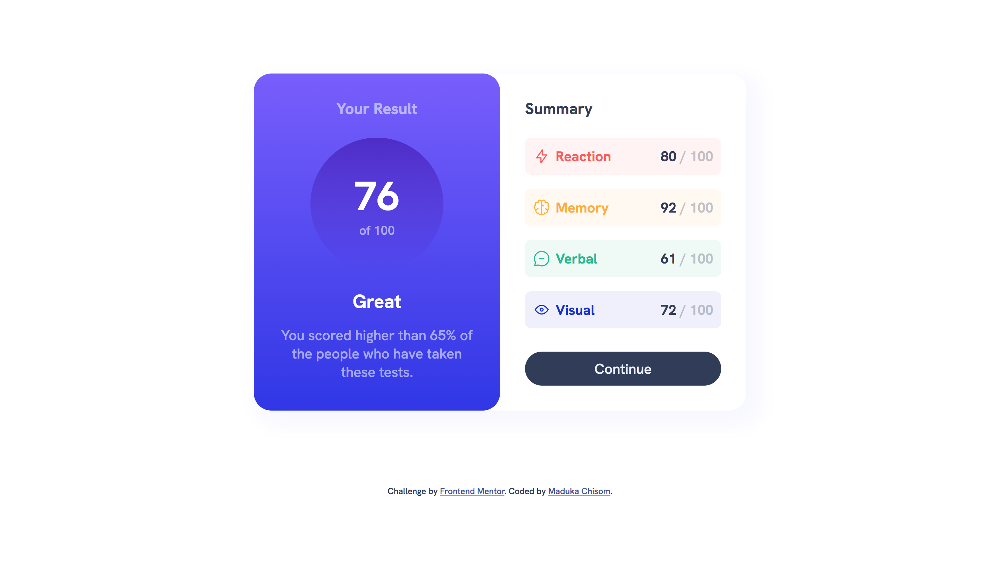

# Frontend Mentor - Results summary component solution

This is a solution to the [Results summary component challenge on Frontend Mentor](https://www.frontendmentor.io/challenges/results-summary-component-CE_K6s0maV). Frontend Mentor challenges help you improve your coding skills by building realistic projects.

## Table of contents

- [The challenge](#the-challenge)
- [Screenshot](#screenshot)
- [Links](#links)
- [My process](#my-process)
  - [Built with](#built-with)
  - [What I learned](#what-i-learned)
  - [Continued development](#continued-development)
  - [Useful resources](#useful-resources)
- [Author](#author)
- [Acknowledgments](#acknowledgments)

**Note: Delete this note and update the table of contents based on what sections you keep.**

### The challenge

Users should be able to:

- View the optimal layout for the interface depending on their device's screen size
- See hover and focus states for all interactive elements on the page
- **Bonus**: Use the local JSON data to dynamically populate the content

### Screenshot




### Links

- Solution URL: [Add solution URL here](https://github.com/Maduka-Chisom/result-summary-component.git)
- Live Site URL: [Add live site URL here](https://your-live-site-url.com)

## My process

- Analyize design, observe document flow and element structure.
- Read instructions
- Wrote the html code first
- Then applied styles in css
- used a bit of css code
- create repository on github
- download Git
- Edit read-me page
- upload file to Github and gitpage

### Built with

- HTML5 markup
- CSS
- Flexbox
- CSS Grid

### What I learned

Use this section to recap over some of your major learnings while working through this project. Writing these out and providing code samples of areas you want to highlight is a great way to reinforce your own knowledge.

- CREATING TRANSITION ON BACKGROUND IMAGE.
  After trying to create a transition animation on a hover gradient background image using the code below:

     <!-- TRANSITION DID NOT WORK  -->

  ```css
  .continue:link,
  .continue:visited {
    background-color: hsl(224, 30%, 27%);
    border-radius: 50px;
    padding: 1rem 2rem;
    display: flex;
    margin-top: 3rem;
    text-decoration: none;
    color: hsl(221, 100%, 96%);
    align-items: center;
    justify-content: center;
    cursor: pointer;
    border: none;
    position: relative;
    transition: background-image 10s linear;
  }

  .continue:hover,
  .continue:active {
    background-image: linear-gradient(
      to bottom,
      rgb(120, 87, 255),
      rgb(46, 43, 233)
    );
  }
  ```

  After trying and meeting road blocks, i did some research and found the solution on google. here is the solution:

```css
.continue:link,
.continue:visited {
  background-color: hsl(224, 30%, 27%);
  border-radius: 50px;
  padding: 1rem 2rem;
  display: flex;
  margin-top: 3rem;
  text-decoration: none;
  color: hsl(221, 100%, 96%);
  align-items: center;
  justify-content: center;
  cursor: pointer;
  border: none;
  position: relative;
}

/* TRANSITION WORKED */
.continue::before {
  position: absolute;
  content: "";
  top: 0;
  right: 0;
  bottom: 0;
  left: 0;
  background-image: linear-gradient(
    to bottom,
    rgb(120, 87, 255),
    rgb(46, 43, 233)
  );
  opacity: 0;
  transition: opacity 0.3s linear;
  z-index: -1;
  border-radius: 50px;
}

.continue:hover::before,
.continue:active::before {
  opacity: 1;
}
```

- learnt how to set up Git and Homebrew

### Continued development

Use this section to outline areas that you want to continue focusing on in future projects. These could be concepts you're still not completely comfortable with or techniques you found useful that you want to refine and perfect.

- Building more projects with css and html

### Useful resources

- [Example resource 1](https://www.freecodecamp.org/news/setup-git-on-mac/) - This helped me for Git and homebrew set up.
- [Example resource 2](https://www.udemy.com/course/design-and-develop-a-killer-website-with-html5-and-css3/learn/lecture/27513370#overview) - This is an amazing course which helped me understand html and css. I'd recommend it to anyone still learning this concept.

## Author

- Website - [Maduka Chisom](https://www.your-site.com)
- Frontend Mentor - [@chisomwest](- Frontend Mentor - [@chisomwest](https://www.frontendmentor.io/profile/yourusername)
  )
- Twitter - [@chisomGmaduka](https://twitter.com/ChisomGMaduka)

## Acknowledgments

- A friend helped point me to an article on how to install Git.
